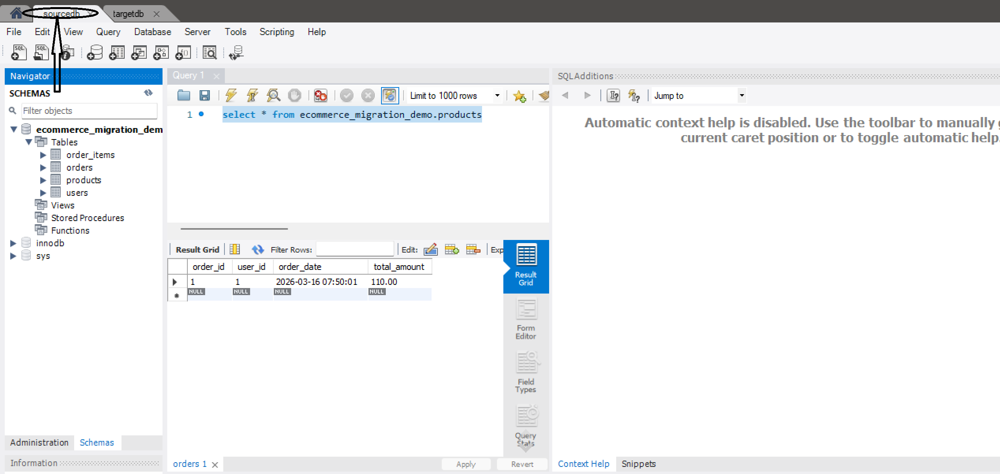
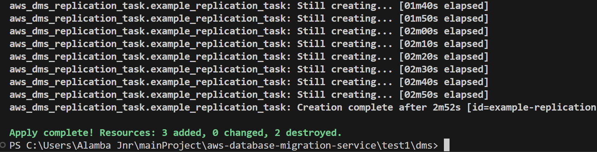
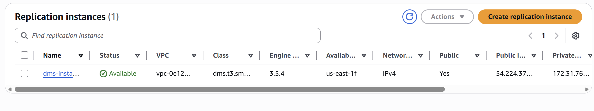
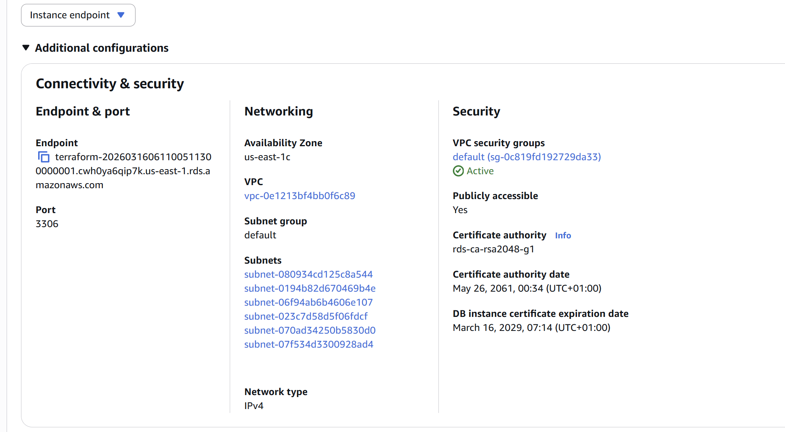
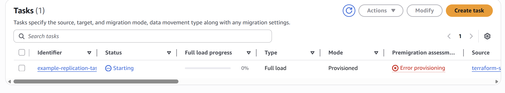
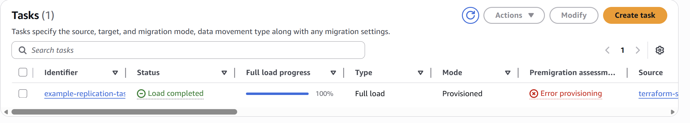
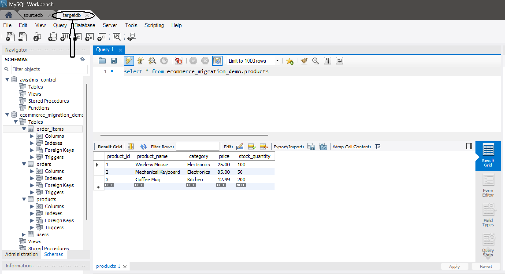

### Updated Professional README.md (Cloud-to-Cloud Version)

```markdown
# AWS Cloud Data Migration: RDS MySQL to Amazon Aurora/RDS

[](https://aws.amazon.com/)
[](https://www.terraform.io/)
[](https://www.mysql.com/)

## 📌 Project Overview
This repository contains a full-stack **Infrastructure as Code (IaC)** deployment of a cloud-to-cloud database migration pipeline. It demonstrates how to migrate a live e-commerce workload between AWS RDS instances using **AWS Database Migration Service (DMS)**.

By leveraging Change Data Capture (CDC), this project achieves a near-zero downtime migration, ensuring data consistency between a source "Legacy" cloud database and a modern "Target" cloud environment.

### Key Features:
* **Infrastructure as Code:** 100% automated provisioning using Terraform modules.
* **Live Synchronization:** Utilizes CDC to replicate ongoing transactions during the migration.
* **Network Security:** Implements fine-grained Security Group rules to bridge the DMS Replication Instance and RDS clusters.
* **Modular Design:** Separate environments for Networking, Source DB, and Migration Logic.

---

## 🏗 Architecture
The project is structured into logical modules to simulate a real-world multi-tier environment:

* **`test1/` (Source Environment):** VPC networking, public subnets, and the Source RDS MySQL instance.
* **`test2/` (Target Environment):** The destination RDS instance, configured to receive the migrated schema.
* **`dms/` (Migration Layer):** The DMS Replication Instance, source/target endpoints, and the replication task.


---

## 🛠 Technical Stack
* **Cloud Provider:** AWS (Global Infrastructure)
* **IaC Tool:** Terraform (v1.x+)
* **Engine:** MySQL 8.0
* **Migration Service:** AWS DMS (Instance Class: `dms.t3.small`)

---

## 🚀 Execution Workflow

### 1. Initialization & Security
Ensure your `.gitignore` is present in the root folder to protect `.tfstate` files and sensitive variables.

### 2. Infrastructure Deployment
Navigate to each directory and apply the configuration in sequence:
```bash
# Deploy Network & Source Database
cd test1 && terraform init && terraform apply -auto-approve

# Deploy Target Database
cd ../test2 && terraform init && terraform apply -auto-approve

# Deploy Migration Service & Start Task
cd ../dms && terraform init && terraform apply -auto-approve

```
## 3. Connectivity & Security Architecture
### Direct-to-RDS Access (Development Workflow)
Unlike a traditional production environment that uses a **Bastion Host (Jump Box)**, this project utilizes a **Direct Connectivity Model** for the development phase. 

* **MySQL Workbench Integration:** The Source and Target RDS instances are configured with `Publicly Accessible = true` and restricted Security Groups, allowing for direct schema modeling and data seeding via MySQL Workbench from a local environment.
* **Why this choice?** This architecture minimizes operational overhead and cost during the POC (Proof of Concept) phase while ensuring the **DMS Replication Instance** remains the primary engine for high-volume data transfer.
* **Network Handshake:** The Security Groups are strictly scoped to allow ingress only from the developer's specific IP and the DMS Replication Instance ID.

### 4. Data Validation

Connect to the Source RDS via MySQL Workbench, seed the `OnlineMerchStore` data, and monitor the **DMS Table Statistics** console to verify 100% row migration to the target instance.

---

📊 Deployment & Migration Validation
1. Infrastructure as Code (Terraform)
The following screenshots show the successful provisioning of the Source and Target RDS instances using Terraform.

<p align="center">


</p>

2. AWS DMS Setup & Connectivity
Verification of the Replication Instance and the Target Endpoint connection.

<p align="center">


</p>

### 3. Migration Task Deep-Dive
To ensure a successful migration, I monitored the task through two critical validation phases:

* **Task Execution & State:** I verified that the DMS Replication Task transitioned successfully to `Load complete`. This confirms the handshake between the Source and Target Endpoints was successful.
  
<p align="center">
  
</p>

* **Table-Level Statistics (Data Integrity):** The "Moment of Truth." This view confirms that the row counts for `products`, `customers`, and `orders` match the source database exactly, with zero validation errors or failed records.

<p align="center">
  
</p>

4. Final Database Verification
Using MySQL Workbench to connect directly to the target RDS instance to verify that the schema, tables, and data were replicated perfectly.

<p align="center">

</p>

## 🔍 Engineering Highlights

* **Task Mapping:** JSON-based object-mapping to selectively migrate the e-commerce schema.
* **Endpoint Authentication:** Secured connection strings via Terraform sensitive variables.
* **Performance Tuning:** Configured `dms.t3.small` instances to handle transaction log (BinLog) caching during Full Load phases.

---

**Author:** [AlambaJnr]
**Portfolio:** [www.linkedin.com/in/collinsuket]

```

---

